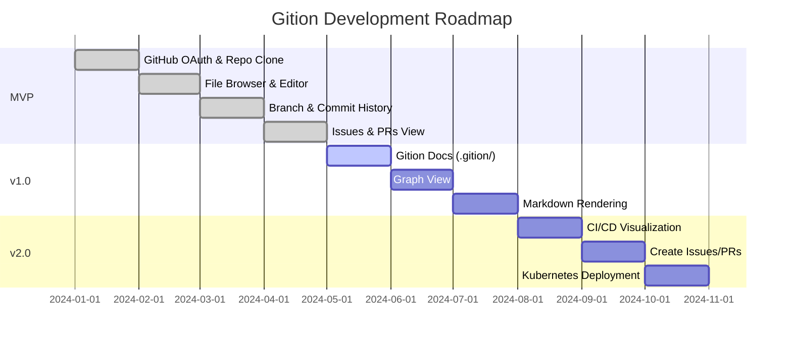

# Gition

> Git + Notion = **Gition**  
> All-in-One Collaboration Platform for Developers

An open-source platform that integrates Git repositories, block-based documentation, and CI/CD into one seamless workflow.

## Why Gition?

Developers constantly switch between tools for **coding → documentation → deployment**.  
Gition solves this by combining everything into **one platform**.

| Problem | Traditional | Gition |
|---------|-------------|--------|
| Code and docs are separate | GitHub + Notion separately | Single workspace |
| No doc version control | Manual backup or none | Git-based auto versioning |
| CI/CD status check | Tab switching required | Real-time display in docs |

## Features

### ✅ Implemented

| Category | Features |
|----------|----------|
| **Auth** | GitHub OAuth 2.0, Session management |
| **Repository** | List all repos, Clone, Filter (Public/Private), Status tracking |
| **File Browser** | Directory navigation, File tree, Size display, Type icons |
| **Editor** | Dark theme (VS Code style), Binary file detection |
| **Branch** | View all branches, Switch branches, Current branch indicator |
| **Commits** | History view, SHA/Author/Date, Insertions/Deletions stats |
| **Search** | Filename search, Content search, Highlighted results |
| **Issues & PRs** | View open issues/PRs, Labels, Branch info |

### 🔜 Upcoming

- [ ] Markdown rendering
- [ ] Create/Edit Issues
- [ ] Create Pull Requests  
- [ ] CI/CD Pipeline visualization

## Roadmap



### Milestone Progress

| Milestone | Status | Progress |
|-----------|--------|----------|
| **MVP** | ✅ Complete | ████████████ 100% |
| **v1.0** | 🔄 In Progress | ██████░░░░░░ 50% |
| **v2.0** | ⏳ Planned | ░░░░░░░░░░░░ 0% |


## Tech Stack

### MVP (Current)

| Layer | Technology |
|-------|------------|
| Frontend | React + Vite + Tailwind CSS |
| Backend | Python FastAPI + GitPython |
| Database | MySQL |
| Auth | GitHub OAuth 2.0 |
| Infra | Docker Compose + Nginx |

### Production (Future)

| Layer | Technology |
|-------|------------|
| Backend | Rust (Axum) + Python (FastAPI) |
| Git Engine | gitoxide / libgit2 |
| Infra | Kubernetes + Helm + ArgoCD |

## Quick Start

### Prerequisites

- Docker & Docker Compose
- GitHub OAuth App

### 1. GitHub OAuth Setup

1. GitHub Settings → Developer settings → OAuth Apps → New
2. Configure:
   - **Homepage URL**: `http://localhost`
   - **Callback URL**: `http://localhost/api/auth/github/callback`
3. Copy Client ID & Secret

### 2. Environment

```bash
# .env
GITHUB_CLIENT_ID=your_client_id
GITHUB_CLIENT_SECRET=your_client_secret
MYSQL_ROOT_PASSWORD=your_password
```

### 3. Run

```bash
git clone https://github.com/your-username/gition.git
cd gition
docker-compose up --build -d
open http://localhost
```

## API Reference

### Auth
```
GET  /api/auth/github          # OAuth URL
GET  /api/auth/github/callback # OAuth callback
```

### Repositories
```
GET  /api/repos                # List repositories
```

### Git Operations
```
POST   /api/git/clone          # Clone repo
POST   /api/git/pull           # Pull changes
GET    /api/git/files          # List files
GET    /api/git/file           # Get file content
GET    /api/git/status         # Clone status
DELETE /api/git/repo           # Delete repo
GET    /api/git/search         # Search files
GET    /api/git/commits        # Commit history
GET    /api/git/branches       # List branches
POST   /api/git/checkout       # Switch branch
```

### GitHub API
```
GET  /api/github/issues        # Get issues
GET  /api/github/pulls         # Get PRs
```

## Project Structure

```
gition/
├── frontend/           # React + Vite
│   ├── src/
│   │   ├── components/
│   │   ├── pages/
│   │   └── lib/
│   └── package.json
├── backend/            # Python FastAPI
│   ├── api/
│   ├── services/
│   ├── models/
│   └── main.py
├── docker-compose.yml
├── nginx.conf
└── README.md
```

## Contributing

1. Fork this repository
2. Create feature branch (`git checkout -b feature/amazing-feature`)
3. Commit changes (`git commit -m 'Add amazing feature'`)
4. Push to branch (`git push origin feature/amazing-feature`)
5. Open a Pull Request

## License

[MIT License](LICENSE)
