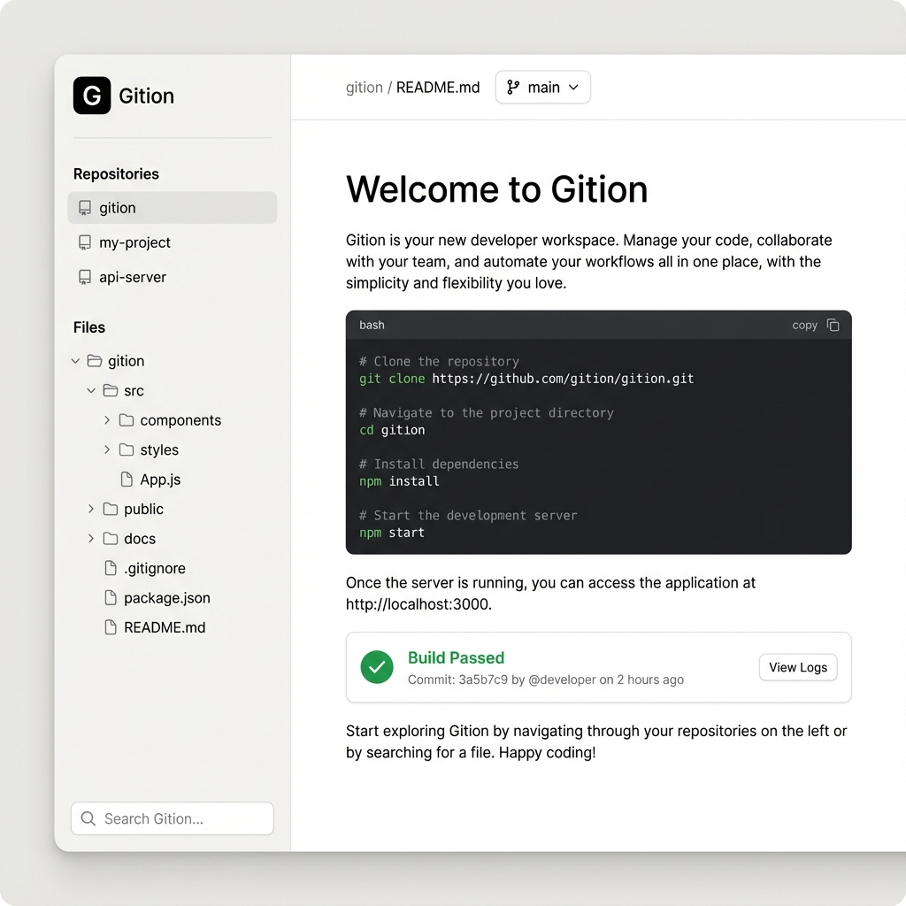
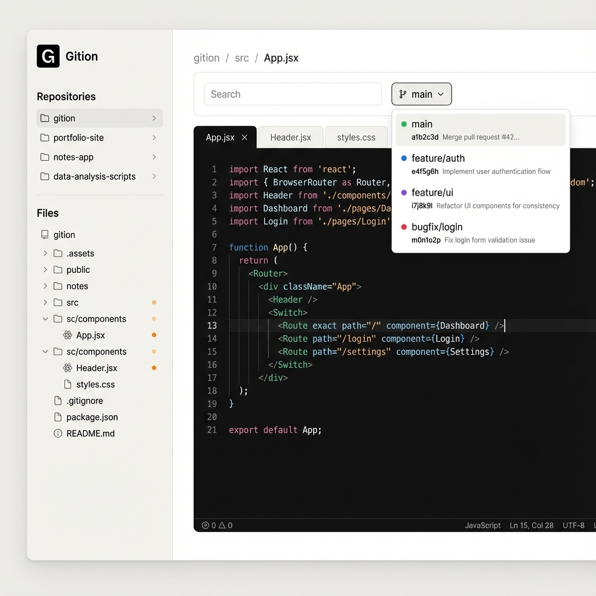
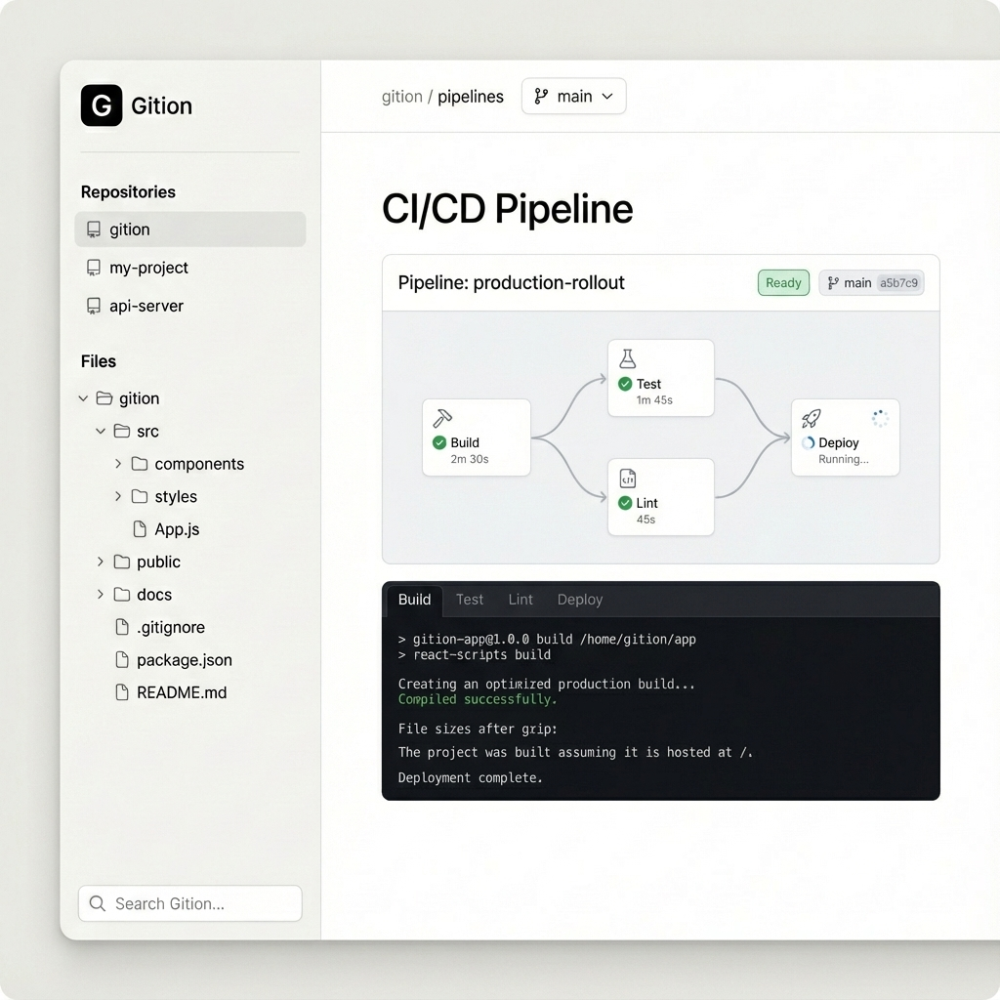

# Gition

> Git + Notion = **Gition**  
> All-in-One Collaboration Platform for Developers

An open-source platform that integrates Git repositories, block-based documentation, and CI/CD into one seamless workflow.



<div style="display: flex; gap: 10px;">
  
  
</div>

## Why Gition?

Developers constantly switch between tools for **coding → documentation → deployment**.  
Gition solves this by combining everything into **one platform**.

| Problem | Traditional | Gition |
|---------|-------------|--------|
| Code and docs are separate | GitHub + Notion separately | Single workspace |
| No doc version control | Manual backup or none | Git-based auto versioning |
| CI/CD status check | Tab switching required | Real-time display in docs |

## Features

### ✅ Implemented

| Category | Features |
|----------|----------|
| **Auth** | GitHub OAuth 2.0, Session management |
| **Repository** | List all repos, Clone, Filter (Public/Private), Status tracking |
| **File Browser** | Directory navigation, File tree, Size display, Type icons |
| **Editor** | Dark theme (VS Code style), Binary file detection |
| **Branch** | View all branches, Switch branches, Current branch indicator |
| **Commits** | History view, SHA/Author/Date, Insertions/Deletions stats |
| **Search** | Filename search, Content search, Highlighted results |
| **Issues & PRs** | View open issues/PRs, Labels, Branch info |
| **Pages** | `.gition` local storage, Branch-specific pages, Git-ignored |

### 🔜 Upcoming

- [ ] Markdown rendering
- [ ] Create/Edit Issues
- [ ] Create Pull Requests  
- [ ] CI/CD Pipeline visualization
- [ ] Page sync across devices

## Roadmap

See [ROADMAP.md](ROADMAP.md) for detailed progress.

### Milestone Progress

| Milestone | Status | Progress |
|-----------|--------|----------|
| **v0.1** | 🔄 In Progress | ████████░░░░ 70%|
| **v0.2** | ⏳ Planned     | ░░░░░░░░░░░░░░░ 0% |
| **v0.3** | ⏳ Planned     | ░░░░░░░░░░░░░░░ 0% |


## Tech Stack

### MVP (Current)

| Layer | Technology |
|-------|------------|
| Frontend | React + Vite + Tailwind CSS |
| Backend | Python FastAPI + GitPython |
| Database | MySQL |
| Auth | GitHub OAuth 2.0 |
| Infra | Docker Compose + Nginx |

### Production (Future)

| Layer | Technology |
|-------|------------|
| Backend | Rust (Axum) + Python (FastAPI) |
| Git Engine | gitoxide / libgit2 |
| Infra | Kubernetes + Helm + ArgoCD |

## Quick Start

### Prerequisites

- Docker & Docker Compose
- GitHub OAuth App

### 1. GitHub OAuth Setup

1. GitHub Settings → Developer settings → OAuth Apps → New
2. Configure:
   - **Homepage URL**: `http://localhost`
   - **Callback URL**: `http://localhost/auth/github/callback`
3. Copy Client ID & Secret

### 2. Environment

```bash
# .env
GITHUB_CLIENT_ID=your_client_id
GITHUB_CLIENT_SECRET=your_client_secret
MYSQL_ROOT_PASSWORD=your_password
MYSQL_USER=your_user
MYSQL_PASSWORD=your_password
```

### 3. Run

```bash
git clone https://github.com/your-username/gition.git
cd gition
docker-compose up --build -d
open http://localhost
```


## Documentation
    
The backend documentation is built using Sphinx.

### Building Docs Locally

1. Install dependencies:
   ```bash
   cd backend
   pip install -r requirements.txt
   ```
2. Build HTML documentation:
   ```bash
   cd docs
   make html
   # Output will be in backend/docs/_build/html/
   ```

## 🤝 Join Us

> **Currently, our team uses a private GitLab repository.**  
> If you're interested in contributing or learning more, feel free to reach out via email or open an issue—we'd be happy to invite you!  
> We're open to AI-assisted contributions at the maintenance level. 🙂

📧 Contact: Open an issue or reach out via GitHub

---

## Contributing

> 📝 Check out our [ROADMAP](ROADMAP.md) for a checklist of features you can contribute to! :)

See [CONTRIBUTING.md](CONTRIBUTING.md) for guidelines.

## License

[MIT License](LICENSE)
